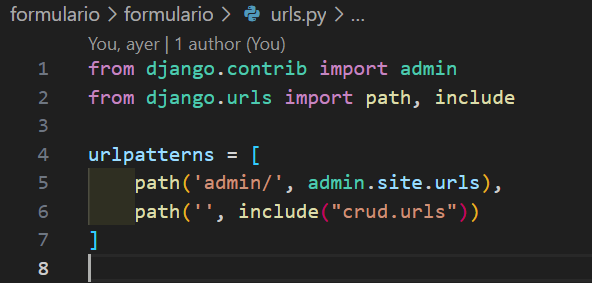
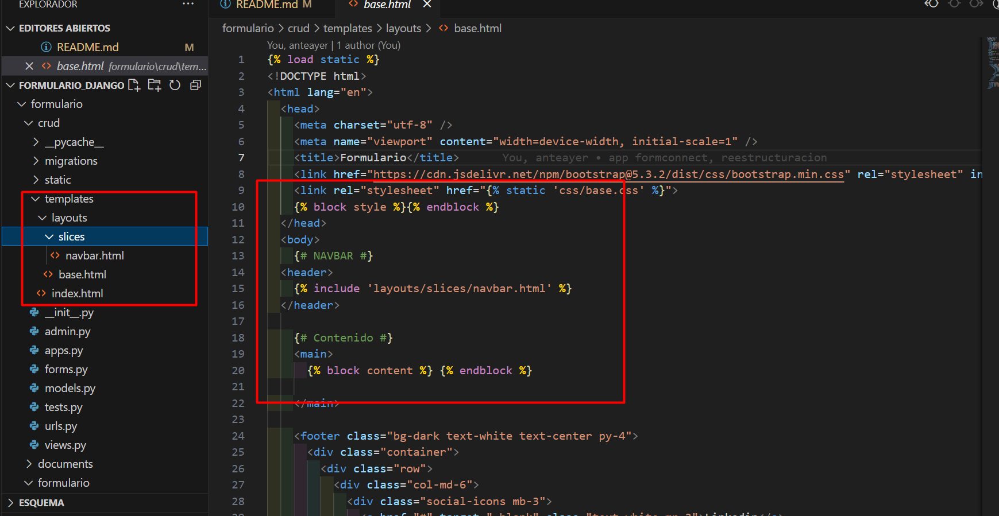

# formulario_Django
Creacion de un formulario simple (sin editar ni eliminar datos)
en conjunto a bases de datos SQLite3
para guardar la informacion del formulario

<a href="https://uiverse.io/Yaya12085/short-turtle-53">
    Estilos CSS utilizados para el Formulario
</a>


# Iniciar servidor Django
Dentro de la carpeta "formulario" se ejecuta el siguiente comando:
```
py manage.py runserver
```


# Configuracion STATIC

Dentro del archivo **settings.py** se debe identificar la ruta **STATICFILES_DIRS**,
 se debe incluir las siguientes rutas de carga para nuestros archivos estaticos. 

```
STATICFILES_DIRS =[
    BASE_DIR / 'static',
    '/var/www/static',
]
```

Tambien se especifica la ruta para el Deploy de la aplicacion que se crea mediante el siguiente comando.

```
mkdir -p /var/www/static
```


# Crear APP
Se debe crear la aplicacion que contendrá el modelo de la base de datos
y donde se consumirá la base de datos mediante funciones y templates.
Esta app se debe incluir dentro de las aplicaciones en el archivo **settings.py**,
luego se incluye dentro de las urls principales **urls.py** mediante **include**.
Utilizando el siguiente comando se crea la app, en este caso la app se llama CRUD:

```
    django-admin startapp crud
```





# Templates
Se crea una carpeta llamada **templates** donde se guardaran los archivos HTML,
Estos templates se deben agregar a la configuracion dentro del archivo **settings.py**.

Dentro de **templates** se encuentran **layouts** y **slices**
donde se maneja una modulacion del archivo **base.html**, el cual contiene las secciones
que se repiten en cada html (**navbar** y **footer**).

En el archivo **base.html** se declaran bloques que serán utilizafos en los demas html
para no contener todo el codigo en el archivo **index.html**





# Crear BD 

Luego de crear la app, dentro del archivo **models.py** 
se crea el modelo de la tabla que contendrá los datos del formulairo.

Al tener el modelo listo se debe crear la migracion del modelo hacia 
la base de datos utilizando los siguientes comandos:

```
    py manage.py makemigrations
```

```
    py manage.py migrate
```


# Crear Formulario

Se crea un archivo llamado **forms.py** donde se crea el formulario que hará envio
de los datos del formulario hacia la base de datos, esto se crea mediante el modelo creado anteriormente.
Al crear los campos se pueden declarar las clases de cada input.

Al crear el formulario se declaran los campos accesibles del modelo de base de datos
para ser guardados y registrados, esto es para evitar el acceso a campos adicionales o
evitar la creacion de otros campos mediante hacking.


# Envio de datos y consumo de BD

Al crear el template **index.html** se crea una funcion para renderizar este archivo,
dentro de esta funcion se crea la logica para enviar los datos mediante el formulario y consumir sus datos
para ser mostrados mediante una tabla, todo esto se crea en el archivo **views.py**.


